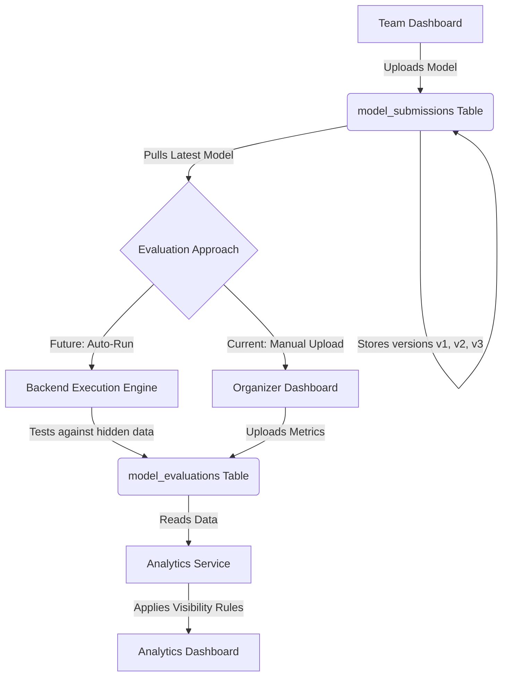

# Model Performance Evaluation & Analytics

## 1. Purpose

The **Model Performance Analytics** system evaluates the actual AI models submitted by participating teams.

**Important Distinction:**
This system is strictly different from Match Prediction Scores.
- **Match Prediction Scores:** Derived from evaluating predicted outputs against real match results. This shows the competition performance of the team.
- **Model Analytics:** Derived from a direct evaluation of the final submitted AI model itself (e.g., assessing code structure, actual machine learning accuracy on test sets, model architecture, etc.). This shows how robust, accurate, and well-engineered the submitted AI model is.

## 2. Complete Flow

The lifecycle of model submission and evaluation follows this sequence:

1. **Team Uploads Model**
   - Teams upload their serialized model files (`.pkl`, `.py`, `.h5`, etc.) via their dashboard.

2. **Model Storage (`model_submissions`)**
   - The system stores the following details in the `model_submissions` table:
     - The physical model file (or file reference)
     - The associated team
     - The model version
     - The timestamp of upload
     - Additional metadata (framework, size, etc.)

3. **Organizer Evaluates Models**
   - Organizers access the uploaded models and conduct performance evaluations. This can be done via automatic pipelines or manual uploads.

4. **Evaluation Storage (`model_evaluations`)**
   - The results are stored in the `model_evaluations` table, which captures:
     - Accuracy
     - Defined strengths
     - Identified weaknesses
     - Category-specific performance (e.g., inference speed, generalization, feature selection)

5. **Analytics Visualization**
   - The Analytics dashboard aggregates these results and provides clear, comparative visualizations for Organizers (and Teams, based on visibility configurations).

## 3. Model Versioning

To encourage iteration, each team is allowed to upload multiple versions of their model throughout the competition window.

**Example Versioning (Team GoalGPT):**
- `v1` - Baseline model
- `v2` - Improved feature engineering
- `v3` - Final tuned model

**Rules:**
- **Immutable Storage:** All versions remain securely stored in the system.
- **Final Evaluation Target:** Only the *latest active model* (e.g., `v3`) is selected and used for the final model performance evaluation.
- **Improvement Tracking:** Older versions (`v1`, `v2`) are maintained specifically for improvement tracking, allowing organizers to see how a team's model evolved over the course of the competition.

## 4. Evaluation Approach

The system is designed to support two distinct evaluation approaches:

### Approach A: Manual Evaluation Upload (Current)
Organizers conduct evaluations externally (e.g., in a Jupyter Notebook or a standalone test environment) and upload the results.
- Organizers upload a model evaluation payload (JSON/CSV) containing the metrics.
- This approach accommodates diverse model formats and custom evaluation parameters without requiring a heavy backend execution environment.
- The Analytics module directly consumes this stored evaluation data for visualizations.

### Approach B: Automatic Evaluation (Future Enhancement)
A fully automated backend evaluation pipeline.
- The backend dynamically loads the submitted model file.
- The model is run against a hidden, standardized dataset.
- The system generates predictions and compares them to the actual results.
- The backend automatically calculates metrics (accuracy, precision, recall) and commits them to the `model_evaluations` table.

## 5. Analytics & Visualization

The Analytics dashboard will introduce a dedicated section for **Model Performance Analytics**, distinct from the Match Prediction Trend.

Features include:
- **Model Comparison Analytics:** Side-by-side comparison of all teams' latest models based on accuracy and category performance.
- **Performance Progression:** Tracking a single team's model accuracy evolution from `v1` to their final version.
- **Team Visibility Configuration:** Organizers can toggle whether teams are allowed to see their own model analytics, or if they are allowed to see a comparative view of all other teams' models.

### Architecture Diagram

